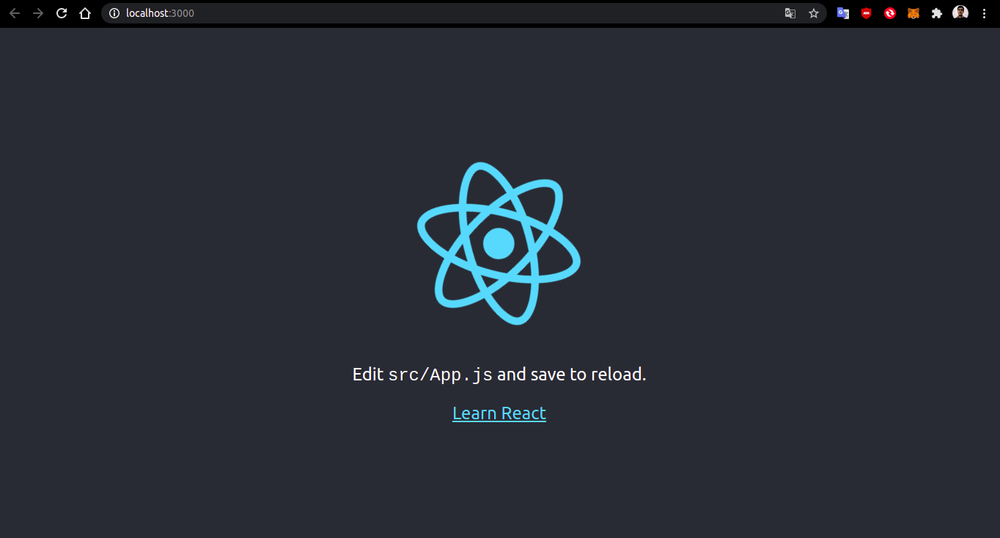
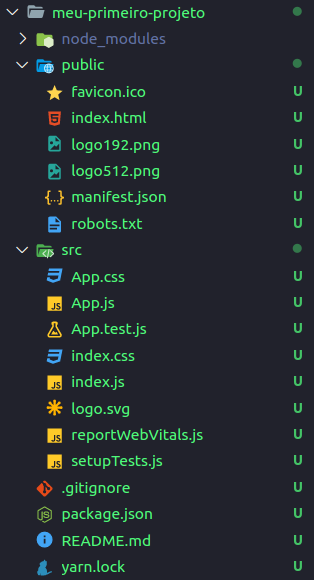
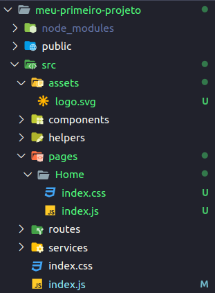

[![Contributors][contributors-shield]][contributors-url]
[![Forks][forks-shield]][forks-url]
[![Stargazers][stars-shield]][stars-url]
[![Issues][issues-shield]][issues-url]
[![MIT License][license-shield]][license-url]

<!-- PROJECT LOGO -->
<br />
<p align="center">
  <a href="https://github.com/SerraZ3/react-js-introducao">
    
  </a>

  <h2 align="center">Introdução ReactJs</h2>

  <p align="center">
    Projeto desenvolvido para aulas
    
    
  </p>
</p>

<!-- TABLE OF CONTENTS -->
<details open="open">
  <summary>Sumário</summary>
  <ol>
    <li>
        <a href="#sobre-o-reactjs">Sobre o ReactJs</a>
        <ul>
            <li><a href="#o-que-é">O que é</a></li>
            <li><a href="#origem">Origem</a></li>
        </ul>
    </li>
    <li>
        <a href="#como-começar">Como começar</a>
        <ul>
            <li><a href="#pré-requisito">Pré-requisitos</a></li>
            <li><a href="#instalação">Instalação</a></li>
        </ul>
    </li>
    <li>
        <a href="#criando-um-projeto-do-zero">Criando um projeto do ZERO</a>
        <ul>
            <li><a href="#criando-projeto">Criando projeto</a></li>
            <li><a href="#rodando-o-projeto">Rodando o Projeto</a></li>
            <li><a href="#estrutura-de-arquivos">Estrutura de arquivos</a></li>
            <li><a href="#hello-world">Hello World</a></li>
        </ul>
    </li>
    <li>
        <a href="#entendendo-o-que-é-um-component">Entendendo o que é um component</a>
        <ul>
            <li><a href="#jsx">JSX</a></li>
            <li><a href="#criando-compenent">Criando component</a></li>
            <li><a href="#o-que-é-props">O que é props?</a></li>
            <li><a href="#trabalhando-com-props">Trabalhando com props</a></li>
            <li><a href="#o-que-é-state">O que é state?</a></li>
            <li><a href="#trabalhando-com-state">Trabalhando com state</a></li>
            <li><a href="#ciclo-de-vida-de-um-compenent">Ciclo de vida de um component</a></li>
        </ul>
    </li>
    <li><a href="#contribuidores">Contribuidores</a></li>
  </ol>
</details>

## Sobre o Reactjs

### O que é?

O ReactJs é uma biblioteca JavaScript declarativa, eficiente e flexível para a criação de interfaces de usuário (UI)" segundo os criadores.

Desde de seu surgimento vem ganhando popularidade e sua comunidade vem crescendo cada vez mais.

### Origem

Ela foi criado pelo Facebook em 2011 para projetos internos e em 2013 foi aberto para a comunidade. Ela foi desenvolvida para a criação de sites web de forma rápida, escalável e simples. Em seguida ela foi adaptada para aplicações mobile com o surgimento do React-Native, que a partir de um código JavaScript é possível criar uma aplicativo para Android e IOS.

---

## Como começar

### Pré-requisitos

Para começar a aprender é necessário saber algumas linguagens e usar algumas ferramentas para facilitar o aprendizado.

Linguagens:

- Javascript
- JSX (Entender como funciona)
- HTML e CSS (é necessário pois todo o JS será convertido em HTML, CSS e JS no final)

Ferramentas:

- NPM (Node Package Manager, Gerenciador de Pacotes Node)

### Instalação

O ReactJs utiliza o `npm` como gerenciador de pacotes. Com ele é possivel instalar o Reactjs e outros pacotes posteriormente.

Para nosso tutorial utilizaremos as seguintes versões do `node` e `npm`

- node: v14.15.1^
- npm: v6.14.1^

Além disso é necessário instalarmos o `create-react-app` para podermos criar nosso projetinho

### Instalando o create-react-app

Instalando create-react-app com npm:

Para instalar com o npm basta rodar o seguinte comando

```sh
npm install create-react-app -g
```

O que esse comando está fazendo? `npm` é o gerenciador, `install` é o comando do `npm` que diz "Hey, quero instalar um pacote", `create-react-app` é o nome do pacote que quero instalar e `-g` significar "global", ou seja, está dizendo "hey, instalar o pacote X de forma global para que eu sempre possa usar ele"

---

## Criando um projeto do zero

Existem duas formas para criar um projeto em ReactJs.

A primeira forma é usando o `create-react-app` que instalamos anteriormente.

A segunda é usando o `npx`. Ele usa os pacotes do `npm` sem precisar baixá-los. Para usar o `npx` é necessário que a versão do `npm` seja maior que `v5.2`.

Para verificar se o `npx` está instalado na sua máquina rode o seguinte comando:

```sh
npx -v
# Comentário
# saida deve ser a versão do seu npx
# exemplo: 6.14.8
```

### Criando Projeto

**Criando projeto com create-react-app:**

Rode o seguinte comando para criar seu projetinho

```sh
create-react-app nome-projeto
```

Em `nome-projeto` você deve por o nome que será o seu projeto

**Criando projeto com npx:**

Esse comando diferente do anterior, ele não instala as configurações do `create-react-app` na sua máquina, ele busca no banco de dados do `npm` e roda direto na sua máquina

```sh
npx create-react-app nome-projeto
```

### Rodando o projeto

Após criar o projeto é preciso rodar um comando no terminal para que a aplicação inicie. O comando deve ser rodado no raiz (dentro da pasta) do seu projeto criado

```sh
npm start
```

O resultado deve ser esse



**O que está acontecendo aqui?**

O React converte código JavaScript e JSX para HTML, CSS e JavaScript para que o navegador possa entender. Com isso, ao rodar esse comando, estamos criando um servidor que monitora as alterações no seu código e realizar essa conversão e, em seguida, atualiza sua aplicação.

O React roda um servidor no `localhost` (127.0.0.1) da sua máquina na porta 3000. É possivel alterar essa configuração posteriormente.

### Estrutura de arquivos

Como resultado da criação do projeto é criado uma pasta com o nome especificado no parametro `nome-projeto`, nesse exemplo usamos `meu-primeiro-projeto` como nome do projeto. A pasta gerada terá os seguintes arquivos:



O diretório é dividido assim:

- `node_modules` _(Pasta com instalação de pacotes externos)_
- public _(Pasta com configuração html do site)_
  - favicon.ico _(Icone do site)_
  - index.html _(Arquivo com a estrutura base do HTML)_
  - logo192.png _(Logo react)_
  - logo512.png _(Logo react)_
  - manifest.json _(Arquivo que descreve seu app e configura para aplicações mobile)_
  - robots.txt _(Arquivo para robos CEO)_
- src _(Pasta com conteúdo do seu site)_
  - App.css _(Estilo do App.js)_
  - App.js _(Onde fica o código de sua aplicação)_
  - App.test.js _(Arquivo de teste)_
  - index.css _(Estilo de toda sua aplicação)_
  - index.js _(Arquivo que chama o component principal)_
  - logo.svg _(Logo)_
  - reportWebVitals.js _(Verifica performance do seu projeto e outras informações)_
  - setupTests.js _(Configuração para testes)_
- .gitignore _(Diz quais arquivos ou pastas não enviar para o github)_
- package.json _(Configuração do gerenciador de pacotes)_
- README
- yarn.lock (ou package-lock.json) _(Arquivo de configuração)_

Para nossos exemplos iremos usar essa estrutura:



Nessa estrutura não alteramos a pasta `public` e `node_modules`.

_Obs:_ Evite alterar a pasta `node_modules` pois são pacotes que são instalados automaticamente quando criado o projeto e quando se baixa algum módulo externo.

Nossa nova estrutura fica dessa forma:

- src _(Pasta com conteúdo do seu site)_
  - assets _(Pasta para salvar imagens, videos e audios)_
    - logo.svg _(Logo)_
  - components _(Pasta que irá ficar components)_
  - helpers _(Pasta para arquivos que auxiliam no desenvolvimento)_
  - pages _(Pasta para paginas da aplicação)_
    - Home _(Uma página da sua aplicação)_
      - index.js _(Component com a página)_
      - styles.css _(CSS da pagina)_
      - styles.js _(arquivo de estilização da página)_
  - routes _(Pasta para gerenciar rota entre telas)_
  - services _(Pasta para gerenciar comunicação com API)_
  - index.css _(Estilo de toda sua aplicação)_
  - index.js _(Arquivo que chama o component principal)_

Em nosso padrão iremos usar o nome das pastas e arquivos em minúsculo, exceto se for um component.

Nesse caso para que sua aplicação possa rodar nesse formato vamos estar apagando o `reportWebVitals.js`, `setupTests.js` e `App.test.js`.

Passaremos o `logo.svg` de `src/logo.svg` para `src/assets/logo.svg`.

Além disso, iremos passar o conteúdo do arquivo `src/App.js` para o `src/pages/Home/index.js` e do `src/App.css` para o `src/pages/Home/styles.css`

O `src/index.js` e o `src/Home/index.js` terão seu conteúdo alterado, pois alteramos o diretório e nome dos arquivos.

O código fica de cada um fica assim:

```js
// src/index.js
import React from "react";
import ReactDOM from "react-dom";
import "./index.css";
import Home from "./pages/Home";

// ReactDOM renderiza o component dentro do método .render()
ReactDOM.render(
  // React.StrictMode é um ferramenta que sinaliza
  // possíveis problemas na aplicação
  <React.StrictMode>
    <Home />
  </React.StrictMode>,
  // Pega o id do elemento que será renderizado o conteúdo a cima
  document.getElementById("root")
);
```

```js
// src/pages/Home/index.js
import logo from "../../assets/logo.svg";
import "./styles.css";

function Home() {
  return (
    <div className="App">
      <header className="App-header">
        
        <p>
          Edit <code>src/App.js</code> and save to reload.
        </p>
        <a
          className="App-link"
          href="https://reactjs.org"
          target="_blank"
          rel="noopener noreferrer"
        >
          Learn React
        </a>
      </header>
    </div>
  );
}

export default Home;
```

Por enquanto não explicarei o que acontece no `Home` pois veremos mais a frente como criar um component.

_Obs:_ Caso sua aplicação não esteja funcionando após alterar diversas pastas recomendo reiniciar o servidor.

### Hello World

Agora que configuramos o projeto, vamos alterar o `src/pages/Home/index.js` para fazermos um Hello World.

Primeiro verifique que o servidor está rodando. Em seguida abra o arquivo e ponha o seguinte código:

```js
// Nome do component. Lembre-se que ele deve ser sempre com a
// primeira letra maiúscula
function Home() {
  // Um component sempre deve retorna um valor
  // Dentro desse return parece que estamos retornando html,
  // mas na verdade estamos retornando JSX que será posteriormente
  // convertido em HTML, CSS e JS
  return (
    <div>
      <h1>Hello World</h1>
    </div>
  );
}
// Sempre devemos exportar um component após criá-lo para podermos usar fora do arquivo
export default Home;
```

Esse deve ser o resultado final


---

## Entendendo o que é um component

Para criarmos um component é preciso entender um pouco como funciona o JSX

### JSX

JSX significa JavaScript XML, ou seja, é uma linguagem de marcação que tem o objetivo converter um código em outro, nesse caso JSX e JS para HTML. O JSX é bastante semelhante ao HTML.

Exemplo:

```js
// Função JS que retorna um JSX
function Exemplo() {
  return (
    <div>
      <h1>Titulo 1</h1>
      <h2>Titulo 2</h2>
      <h3>Titulo 3</h3>
      <p>Parágrafo</p>
    </div>
  );
}
```

Uma diferença entre o html é que o JSX aceita código JS e possui alguns nomes diferentes para alguns atributos.

A maior das tags html iremos usar da mesma forma no JSX, mas terão algumas que será necessário buscar na documentação como é a sintaxe. Nos exemplos tentaremos usar o máximo possivel, mas como são muitas será necessário buscar fontes externas.

_Atenção!_ Nesse exemplo podemos perceber que usamos JS e JSX no mesmo arquivo .js. Tudo fora do `return` é código JS e o que está dentro é JSX

**Comentário**

```js
function Exemplo() {
  // Comentário em JS
  return (
    <div>
      {/* Comentário em JSX */}
      <h1>Titulo 1</h1>
      <h2>Titulo 2</h2>
      <h3>Titulo 3</h3>
      <p>Parágrafo</p>
    </div>
  );
}
```

**JS no JSX**

Para usar variáveis no JSX devemos seguir o seguinte exemplo:

```js
function Exemplo() {
  const titulo1 = "Titulo 1";
  var titulo2 = "Titulo 2";
  let titulo2 = "Titulo 3";

  return (
    <div>
      <h1>{titulo1}</h1>
      <h2>{titulo2}</h2>
      <h3>{titulo3}</h3>
      <p>Parágrafo</p>
    </div>
  );
}
```

Para conseguir imprimir no JSX é necessário que a variável seja um string, number ou outro objeto JSX. Se for um Array ou Objeto irá gerar erro

É possivel mapear arrays e imprimir diversos elementos de uma vez

```js
function Exemplo() {
  const comprarNoMercado = ["Banana", "Maça", "Leite", "Paçoca"];

  return (
    <div>
      <h1>Lista de compras</h1>
      <ul>
        {
          // Array que iremos mapear
          comprarNoMercado.map((item) => {
            // Para imprimirmos na tela é necessário retornar um JSX ou string
            // Aqui estamos retornando um JSX
            return <li>{item}</li>;
          })
        }
      </ul>
    </div>
  );
}
```

**Style**

A estilização no JSX possui uma sintaxe um pouco diferente do CSS, mas com a mesma lógica. O nome da sintaxe usada é CSS-in-JS

```js
function Exemplo() {
  // Declarando variável de estilização
  const styleH3 = {
    height: "10px",
    backgroundColor: "blue",
    marginBottom: "5em",
    // Ao se colocar o numero sem dizer o tipo de medida
    // Ele automaticamente converte para px
    // 50 => 50px
    marginTop: 50,
  };

  const titulo = {
    color: "red",
    // 10 => 10px
    paddingTop: 10,
    paddingBottom: "10px",
  };
  return (
    <div>
      {/* Estilo direto na tag */}
      <h1 style={{ fontColor: "red" }}>Titulo 1</h1>
      {/* Multiplos estilos em um elemento */}
      <h2 style={{ ...{ backgroundColor: "#606060" }, ...titulo }}>Titulo 2</h2>
      {/* Multiplos estilos em um elemento */}
      <h3 style={{ ...styleH3, ...titulo }}>Titulo 3</h3>
      <p style={{ height: 10 }}>Parágrafo</p>
    </div>
  );
}
```

A conversão da sintaxe do css para a sintaxe do CSS-in-JS funciona assim:

Termos `background-color: blue;` do css, para transformar para CSS-in-JS retiramos o `-`, que une `background` a `color`, e em seguida colocamos a primeira letra da segunda palavra em maiusculo: `backgroundColor`. O valor desse estilo deve vir entre aspas para conseguir ser identificado: `backgroudColor: "blue"`.

Estilos que não são palavras compostas possuem a mesma sintaxe, ex: `height`, `width`, `margin`...

Se desejar saber mais a respeito de estilização basta olhar esse [link da documentação](https://pt-br.reactjs.org/docs/dom-elements.html#style)

### Criando Component

Até o momento viemos criando components

```js
// Esse aqui é o component home
function Home() {
  return (
    <div>
      <h1>Hello World</h1>
    </div>
  );
}

export default Home;
```

De forma resumida podemos dizer que component é uma função que retorna um elemento JSX. Existem diversas formas de criar um component. Iremos mostrar alguns exemplos de como lidar com eles

```js
// Arquivo src/pages/Home/index.js
// Forma padrão de declaração
function Home() {
  return (
    <div>
      <h1>Hello World</h1>
    </div>
  );
}
export default Home;
```

```js
// Arquivo src/pages/Home/index.js
// Através de arrow functions
const Home = () => {
  return (
    <div>
      <h1>Hello World</h1>
    </div>
  );
};
export default Home;
```

```js
// Arquivo src/pages/Home/index.js
// Podemos criar um outro component para melhorar sua reutilização
function Hello() {
  return <h1>Hello World</h1>;
}
function Home() {
  return (
    <div>
      <Hello />
      <Hello />
      <Hello />
    </div>
  );
}
export default Home;
```

```js
// Arquivo src/pages/Home/index.js
// Podemos criar um outro component para melhorar sua reutilização
// Usando arrow functions
const Hello = () => <h1>Hello World</h1>;

function Home() {
  return (
    <div>
      <Hello />
      <Hello />
      <Hello />
    </div>
  );
}
export default Home;
```

Essas são as formas básicas para criar um component. Podemos estar usando components a partir de outros arquivos. Por exemplo:

```js
// Arquivo src/components/Hello/index.js

const Hello = () => <h1>Hello World</h1>;

export default Hello;
```

```js
// Arquivo src/pages/Home/index.js
import Hello from "../../components/Hello";
// Em JS ele pega por padrão o arquivo index.js, então podemos emitir, mas podemos chamar o index também (não recomendo chamar)
// import Hello from "../../components/Hello/index.js";

function Home() {
  return (
    <div>
      <Hello />
      <Hello />
      <Hello />
    </div>
  );
}
export default Home;
```

---

## Contribuidores

- [Henrique Serra](https://github.com/SerraZ3)

[contributors-shield]: https://img.shields.io/github/contributors/SerraZ3/react-js-introducao.svg?style=for-the-badge
[contributors-url]: https://github.com/SerraZ3/react-js-introducao/graphs/contributors
[forks-shield]: https://img.shields.io/github/forks/SerraZ3/react-js-introducao.svg?style=for-the-badge
[forks-url]: https://github.com/SerraZ3/react-js-introducao/network/members
[stars-shield]: https://img.shields.io/github/stars/SerraZ3/react-js-introducao.svg?style=for-the-badge
[stars-url]: https://github.com/SerraZ3/react-js-introducao/stargazers
[issues-shield]: https://img.shields.io/github/issues/SerraZ3/react-js-introducao.svg?style=for-the-badge
[issues-url]: https://github.com/SerraZ3/react-js-introducao/issues
[license-shield]: https://img.shields.io/github/license/SerraZ3/react-js-introducao.svg?style=for-the-badge
[license-url]: https://github.com/SerraZ3/react-js-introducao/blob/main/LICENSE
